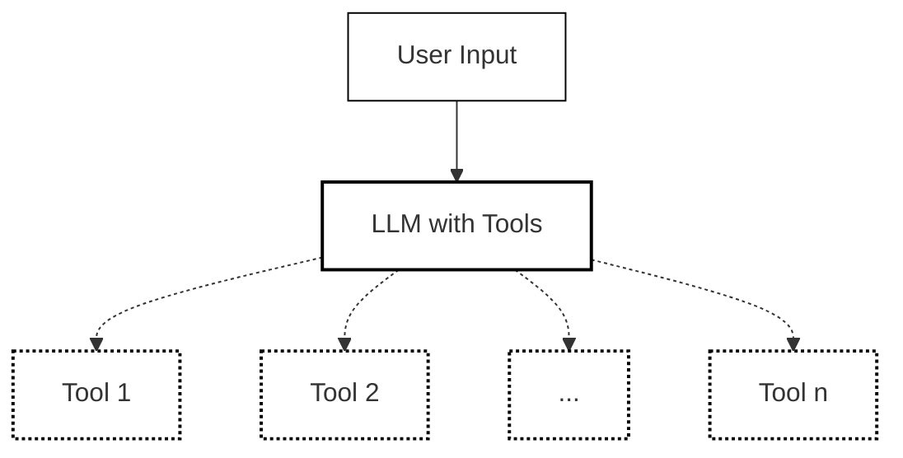

Using LLM with tools as intent classifier

## setup project

### Prerequisites

1. Install uv [guide](https://docs.astral.sh/uv/getting-started/installation/)

### Setup

```bash
cd <this project folder>
uv sync
pre-commit install
cp .env.sample .env
```

you do not need to do `uv init` because we have already done it for you.

### Activate virtual environment

MacOS/Linux

```bash
source .venv/bin/activate
```

Windows

```bash
.venv\Scripts\activate
```

### vscode extensions
1. code . (open the project in vscode)
1. install the recommended extensions (cmd + shift + p -> `Extensions: Show Recommended Extensions`)

# Overview
This project is an intent classifier that uses a large language model (LLM) with tools to classify intents based on user input. It is designed to be flexible and extensible, allowing for easy integration of new intent types.



The different intent are defined in a JSON file [`tool_definitions.json`](./tool_definitions.json). Each intent has a key and a description, which is used to guide the LLM in understanding the intent. The LLM uses these definitions to classify the user input into one of the defined intents.


# Classification

```bash
python -m intent_classifier_llm_tools.main
```

# Testing

## Unit Tests

```bash
python -m pytest -p no:warnings --cov-report term-missing --cov=intent_classifier_llm_tools tests
```

## Linting
these are handled by pre-commit hooks

```sh
ruff format .
```

```sh
ruff check .
```

```sh
pyright .
```

## generate requirements.txt
these are handled by pre-commit hooks

```sh
uv lock
uv export --frozen --no-dev --output-file=requirements.txt
uv export --frozen --all-groups --output-file=requirements.dev.txt
```

## packages scanning
these are handled by pre-commit hooks

```sh
pip-audit -r requirements.txt